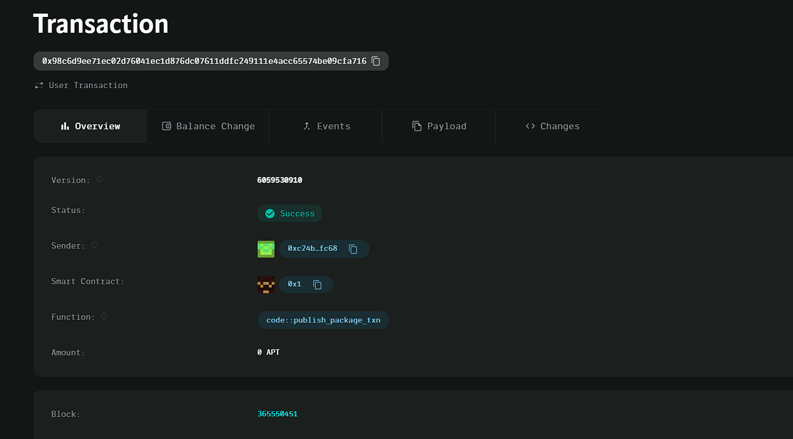

### Deployed smartcontract address: 0x98c6d9ee71ec02d76041ec1d876dc07611ddfc249111e4acc65574be09cfa716

### Screenshot: 

# Decentralized Crowdsourcing Platform

## Project Title
Decentralized Crowdsourcing Platform

## Project Description
A decentralized platform where users can submit tasks or projects for completion by the community. Contributors can claim rewards from the project's reward pool for their contributions, ensuring transparency and fairness through blockchain technology.

## Vision
To create a transparent and decentralized environment where community members can collaborate on tasks, contributing skills and effort, and receive rewards based on their input.

## Key Features
- Submit tasks with a description and reward pool.
- Contributors can claim rewards for their efforts on tasks.
- Secure and transparent handling of rewards using Aptos blockchain.

## Future Scope
- Implement voting mechanisms for task approval.
- Add reputation tracking for contributors.
- Automate the distribution of rewards based on task verification.
